ocelotgui A GUI for Tarantool

Version 2.2.0

The ocelotgui GUI, a database client, allows users to connect to
a Tarantool (tm) server, enter SQL statements, and receive results.
Some of its features are: syntax highlighting, user-settable colors
and fonts for each part of the screen, result-set displays
with multi-line rows and resizable columns.

Copyright (c) 2024 by Peter Gulutzan
All rights reserved.

For the GPL license terms see <A href="https://github.com/ocelot-inc/ocelotgui/blob/master/LICENSE.GPL">https://github.com/ocelot-inc/ocelotgui/blob/master/LICENSE.GPL</A>.

This README file has installation instructions, screenshots, and a user manual which has been stripped so it only shows what is relevant for Tarantool.

<H3>Contents</H3>

<H4>Installing</H4>
... <A href="#prerequisites">Prerequisites</A>
... <A href="#getting-the-qt-library">Getting the Qt library</A>
... <A href="#getting-the-libmysqlclientso-library">Getting the libmysqlclient.so library</A>
... <A href="#getting-the-ocelotgui-executable-package">Getting the ocelotgui executable package</A>
... <A href="#starting-the-program">Starting the program</A>
<H4>Illustrating</H4>
... <A href="#some-screenshots">Some screenshots</A>
<H4>Using</H4>
... <A href="#user-manual">User Manual</A>
... <A href="#executive-summary">Executive Summary</A>
... <A href="#the-developer-the-product-and-the-status">The developer, the product, and the status</A>
... <A href="#downloading-installing-and-building">Downloading, installing, and building</A>
... <A href="#starting">Starting</A>
... <A href="#statement-widget">Statement widget</A>
... <A href="#client-statements">Client statements</A>
... <A href="#history-widget">History widget</A>
... <A href="#result-widget">Result widget</A>
... <A href="#menu">Menu</A>
... <A href="#special-effects">Special effects</A>
... <A href="#explorer-widget">Explorer widget</A>
... <A href="#ERDiagram">ERDiagram</A>
... <A href="#charts">Charts</A>
... <A href="#contact">Contact</A>
<H4>Appendixes</H4>
... <A href="#Appendix-1">Appendix 1 Details about ocelotgui options</A>
... <A href="#Appendix-2">Appendix 2 Debugger<A>
... <A href="#Appendix-3">Appendix 3 Tarantool Extras</A>
... <A href="#Appendix-4">Appendix 4 windows</A>
... <A href="#getting-and-using-the-ocelotgui-source">Appendix 5 Getting and using the ocelotgui source</A>

<H3 id="prerequisites">Prerequisites</H3>

The installation instructions in this section are for Linux.
If you prefer to run on Windows, read the installation instructions
in <A href="#Appendix-4">Appendix 4 windows</A>
and come back to read the User Manual section.

The basic prerequisites for installation are Linux, and the Qt library.

<H3 id="getting-the-qt-library">Getting the Qt library</H3>

You probably will find that the Qt package is already installed,
since other common packages depend on it. If not, your Linux
distro's repositories will provide a Qt package.
For example, on some platforms you can say
"sudo apt-get install libqt5core5a libqt5widgets5" , on others you can say "dnf install qt qt-x11",
on others you can say "dnf install qt5-qtbase qt5-qtbase-gui".

The Qt version number can be found with <i>find /usr/lib -name "libQt*Gui.so*"</i>, or <i>find /usr/lib64 -name "libQt*Gui.so*"</i>.
If the response starts with libQtGui.so.4 then you have Qt4,
if the response starts with libQt5Gui.so.5 then you have Qt5.
Alternatively it sometimes can be found with qmake -v.
Peter Gulutzan supplies executables only for Qt version 5, but if you have Qt version 4 or Qt version 6 you can build from source.

The Qt library is necessary for ocelotgui installation.

<H3 id="getting-the-ocelotgui-executable-package">Getting the ocelotgui executable package</H3>

There are ocelotgui binary packages for platforms such as Ubuntu/Mint/MX where "Debian-like" packages
are preferred, or platforms such as Mageia/SUSE/Fedora (but not CentOS 7) where "RPM-like" packages
are preferred.
If one of the following ocelotgui binary packages is compatible with your platform,
cut and paste the corresponding pair of instructions onto your computer and
you can be up and running in about 15 seconds.  
For 32-bit, Debian-like, Qt5<PRE>
wget https://github.com/ocelot-inc/ocelotgui/releases/download/2.2.0/ocelotgui_2.2.0-1_i386.deb
sudo apt install ./ocelotgui_2.2.0-1_i386.deb</PRE>
For 64-bit, Debian-like, Qt5<PRE>
wget https://github.com/ocelot-inc/ocelotgui/releases/download/2.2.0/ocelotgui_2.2.0-1_amd64.deb
sudo apt install ./ocelotgui_2.2.0-1_amd64.deb</PRE>
For 64-bit, RPM-like, Qt5<PRE>
wget https://github.com/ocelot-inc/ocelotgui/releases/download/2.2.0/ocelotgui-2.2.0-1.x86_64.rpm
sudo rpm -i ocelotgui-2.2.0-1.x86_64.rpm</PRE>
For 64-bit, any Linux, Qt5<PRE>
wget https://github.com/ocelot-inc/ocelotgui/releases/download/2.2.0/ocelotgui-2.2.0.tar.gz
tar zxvf ocelotgui-2.2.0.tar.gz
ocelotgui/ocelotgui-qt5</PRE>
For 64-bit, any Linux, Qt4 (deprecated)<PRE>
wget https://github.com/ocelot-inc/ocelotgui/releases/download/2.2.0/ocelotgui-2.2.0.tar.gz
tar zxvf ocelotgui-2.2.0.tar.gz
ocelotgui/ocelotgui-qt4</PRE>

<H3 id="starting-the-program">Starting the program</H3>

After installing and making sure that ocelotgui is on the
path, start it with<PRE>
ocelotgui --ocelot_dbms=tarantool</PRE>
along with some of many options for example<PRE>
ocelotgui --ocelot_dbms=tarantool --host=localhost --port=3302 --user=guest</PRE>
or<PRE>
ocelotgui --ocelot_dbms=tarantool --host=127.0.0.1 --port=3301 --user=joe --password=secret</PRE>
-- if the program starts, and menu items such as Help|Manual
work, then installation is successful.
Stop again with File|Exit or control-Q.

Warning: Some menu shortcut keys may not work properly with Ubuntu 14.04.

<H2 ID="some-screenshots">Some screenshots</H2>

<A href="shot1.jpg">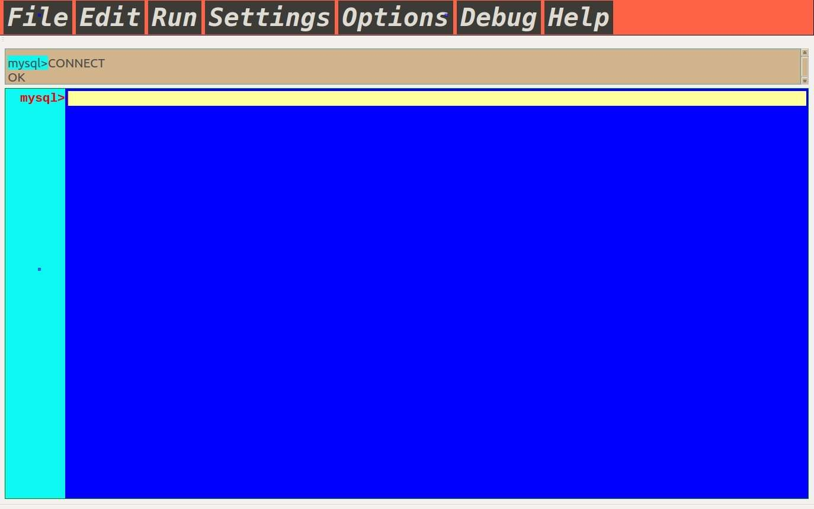</A>
<A href="shot2.jpg">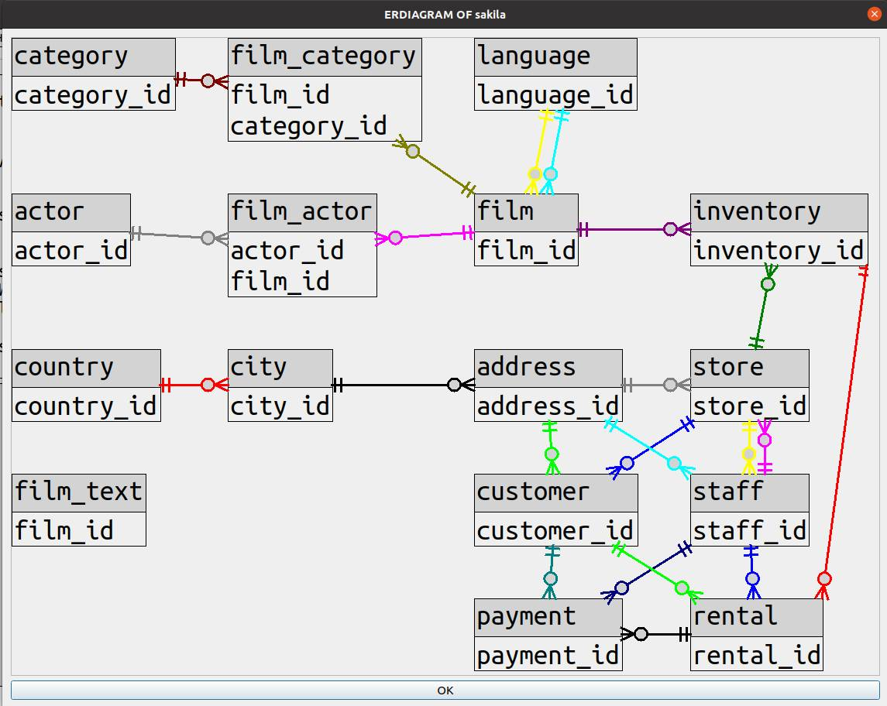</A>
<A href="shot3.png">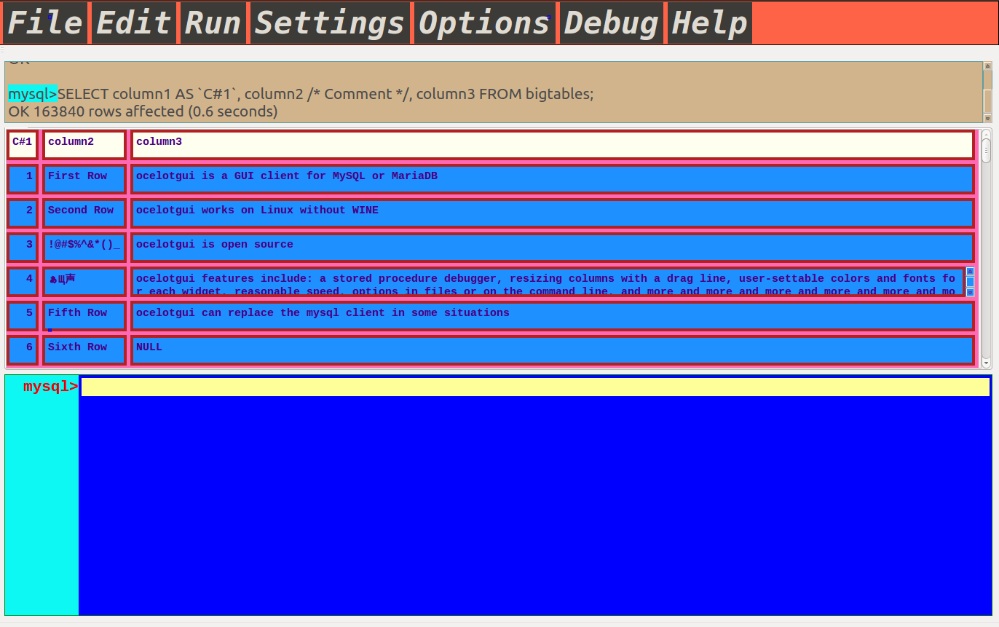</A>
<A href="shot4.jpg">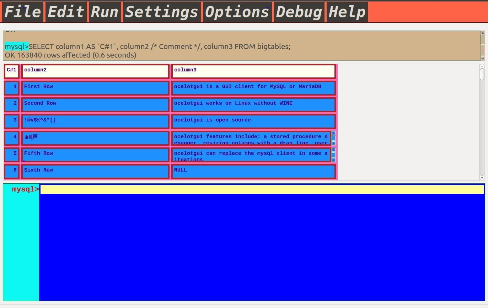</A>
<A href="shot5.jpg">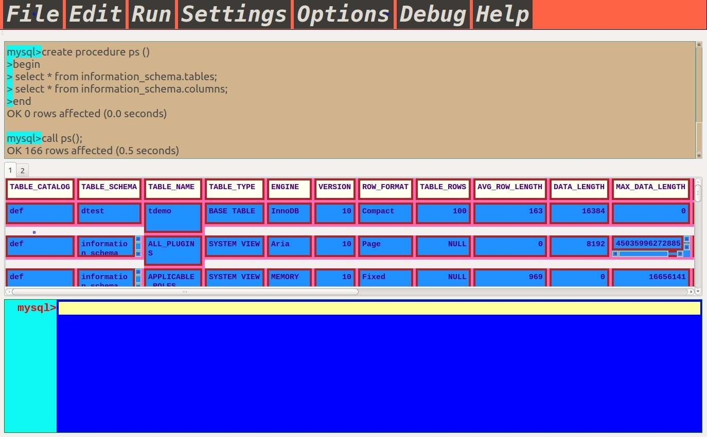</A>
<A href="shot6.jpg">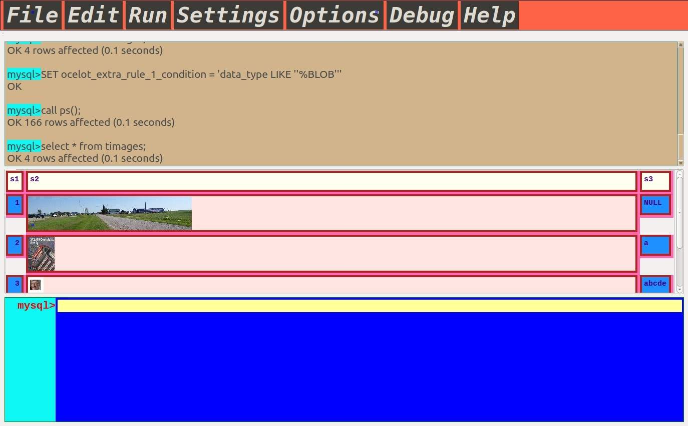</A>
<A href="shot7.jpg">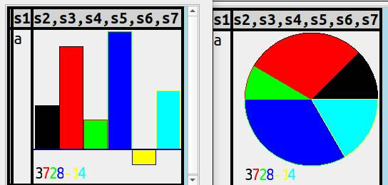</A>
<A href="shot8.jpg">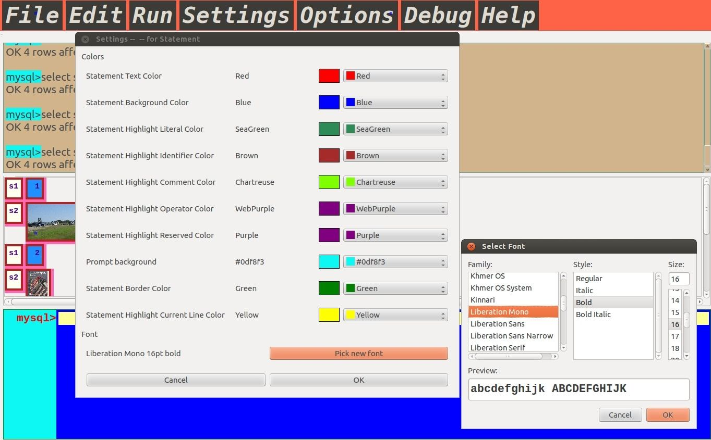</A>
<A href="shot9.jpg">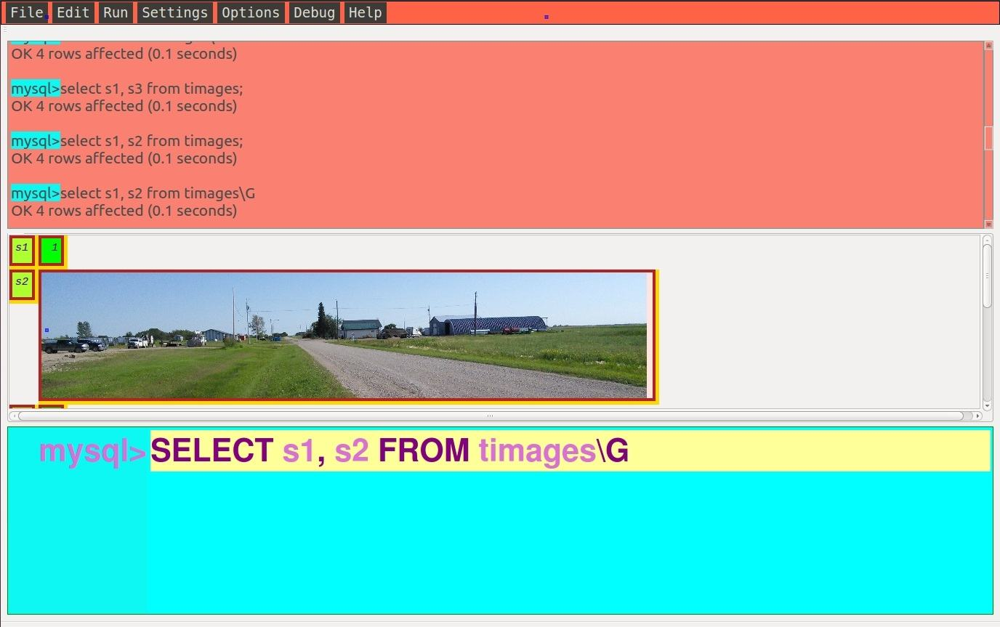</A>
<A href="shot10.jpg">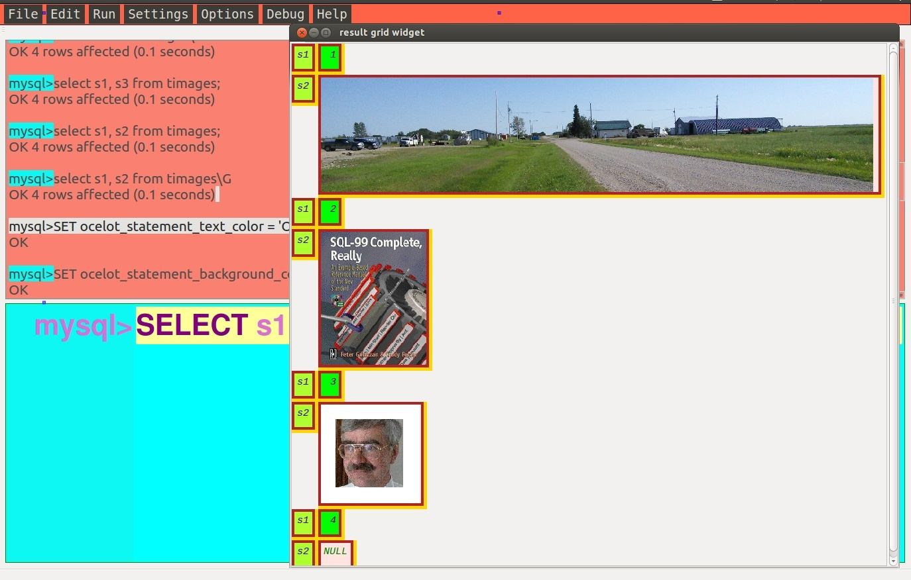</A>
<A href="shot11.png">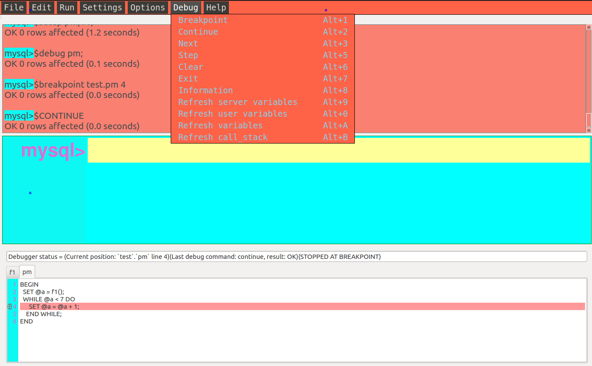</A>
<A href="explorer1.png">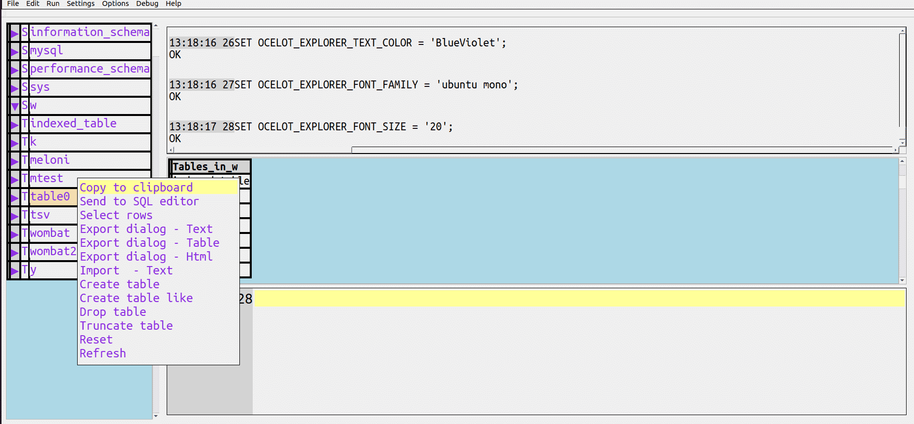</A>

<H2 ID="user-manual">User Manual</H2>

Version 2.2.0, February 15 2024

Copyright (c) 2024 by Peter Gulutzan. All rights reserved.

  

This program is free software; you can redistribute it and/or modify  
it under the terms of the GNU General Public License as published by  
the Free Software Foundation; version 2 of the License.

  

This program is distributed in the hope that it will be useful,  
but WITHOUT ANY WARRANTY; without even the implied warranty of  
MERCHANTABILITY or FITNESS FOR A PARTICULAR PURPOSE. See the  
GNU General Public License for more details.

  

You should have received a copy of the GNU General Public License  
along with this program; if not, write to the Free Software  
Foundation, Inc., 51 Franklin St, Fifth Floor, Boston, MA 02110-1301 USA

<H3 id="executive-summary">Executive Summary</H3>

The ocelotgui application, formerly called
'The Ocelot Graphical User Interface', allows users to connect to
a Tarantool DBMS server, enter SQL statements, and receive results.
Some of its features are: syntax highlighting, user-settable colors
and fonts for each part of the screen, and result-set displays
with multi-line rows and resizable columns.

<H3 id="the-developer-the-product-and-the-status">The developer, the product, and the status</H3>

Peter Gulutzan is a Canadian
who has specialized in database products for thirty years,
as an employee of Ocelot Computer Services Inc. and
MySQL AB and Sun Microsystems and Oracle and HP, or as a
contractor for a large company in eastern Europe.

The ocelotgui program is a front end which connects to Tarantool (tm).
In some ways it is like the mysql client program that connects to MySQL or MariaDB servers,
with added GUI features: full-screen editing, syntax
highlighting, tabular display, customized fonts and colors.
It differs from some other front-end GUI products because
it is open source (GPL), it is written in C++, and it makes use
of the Qt multi-platform widget library.

  

The product status is: stable. It has been known to work as described in
this manual on several Linux distros. It is stable, in the sense that
there are no known severe errors and the features are frozen until the
next version.
Peter Gulutzan will address any bug reports and will answer any questions.

<H3 id="downloading-installing-and-building">Downloading, installing, and building</H3>

To download the product go to
<A HREF="https://github.com/ocelot-inc/ocelotgui">https://github.com/ocelot-inc/ocelotgui</A>.
Instructions for installation will be in the README.md file.
This location may change, or alternate locations may appear.
If so there will either be an announcement on github or on ocelot.ca.

The package contains source code and an executable file named ocelotgui-qt5.

<H3 id="starting">Starting</H3>

There must be an instance of Tarantool running somewhere.  

If connection is possible with the tarantoolctl client and does not require
unusual options, then connection is possible with ocelotgui. Options can
be supplied in a special file (usually called ~/.my.cnf) or on a command line.
Therefore the typical
way to start the program is to say  
ocelotgui [--option [--option...]]  
 
For a description of options see  <A href="#Appendix-1">Appendix 1 Details about ocelotgui options</A>.

<A href="starting-dialog.png">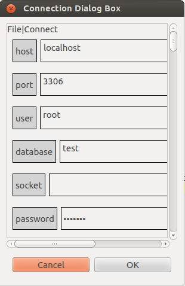</A>
If a password is required but not supplied, a dialog box will appear.
Or, if the initial attempt to connect fails, an error message will appear
saying it is necessary to choose File|Connect, which will cause the dialog
box to appear. The dialog box has many possible settings
(see the list in <A href="#Appendix-1">Appendix 1</A>);
however, for getting started, the ones that matter most are the ones
at the top: host, port, user, password.  
If the connection still fails, then ocelotgui will still come up,
but only non-DBMS tasks such as screen customizing will be possible.
 

<A href="starting.png">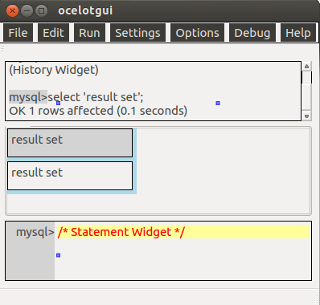</A>
In any case, an initial screen will appear. After some activity has
taken place, the screen will have four parts, from top to bottom: 
menu  
history widget, where retired statements and diagnostics end up  
results widget, where SELECT result sets appear  
statement widget, where users can type in instructions. 
(And optionally, on the side, an explorer widget.)
Initially, though, only the menu and statement widget will appear.

Again, this should be reminiscent of the way a non-GUI client works:
statements are typed at the bottom of the screen, and appear to
scroll off the top after they are executed, with results in the middle.  

 
<H3 id="statement-widget">Statement widget</H3>

The statement widget is an editable multi-line text box.
The usual control keys that work on other text editors will work
here too; see the later description of Menu Item: Edit.

  

The program includes a syntax checker and can recognize the parts of
speech in Tarantool grammar.
It will do syntax highlighting
by changing the color, for example comments will appear in light green,
identifiers in green, operators in dark gray, and so on.  
The colors can be
customized, see the later description of Menu Item: Settings.

The left side of the statement widget is reserved for the prompt,
and cannot be typed over. Initially the prompt will be 'tarantool&gt;'
but this can be changed, see the later description of
Client Statements: Prompt.  

<A href="statement-widget-example.png">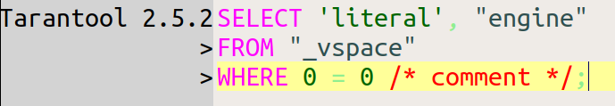</A>
For example, this screenshot shows the statement widget
after the user has changed the default prompt and
entered an SQL statement.
The statement has keywords in magenta, literals in dark green,
operators in light green, and comments in red.
The prompt on the left has a gray background.
  

Major Feature Alert: this is not merely a GUI that only will
highlight words that are in a list of keywords.
This GUI will parse the complete Tarantool grammar,
without needing to ask the server. So the highlighting
will be correct, syntax errors will be underlined in red,
and -- since the parsing method is predictive -- there will be
continuous hints about what word is expected next, and
optionally an error message explaining suspected syntax problems
before they go to the server.

Once a statement has been entered and is ready to be executed,
the user can hit control-E, choose menu item Run|Execute, or
place the cursor at the end of the text (after the ';' or other
delimiter) and type Enter. It is legal to enter multiple
statements, separated by semicolons, and then execute them
in a single sequence.

<H3 id="client-statements">Client statements</H3>

A client statement is a statement which changes some behavior
of the client (that is, of the ocelotgui front end) but does not
necessarily go to the Tarantool server. Try out a few:  
SET OCELOT_STATEMENT_HIGHLIGHT_KEYWORD_COLOR = 'Fuchsia';  
PROMPT Tarantool \v;  
STATUS;  
Other interesting ones are DELIMITER (similar to the Tarantool
console's delimiter), SOURCE to read statements from a file,
and EXIT or QUIT.
For example, entering 'quit;'
followed by Enter will cause the program to stop. It is
sometimes not mandatory to end a client statement with ';',
but is strongly recommended.

There are some enhancements affecting the PROMPT statement.
The special sequence '&#92;2' means 'repeat the prompt on all lines',
and the special sequence '&#92;L' means 'show line numbers'. For example,
'PROMPT &#92;2&#92;Tarantool;' will change the prompt so that each line begins
with '[line number] Tarantool>'.

<H3 id="history-widget">History widget</H3>

Once a statement has been executed, a copy of the statement text
and the diagnostic result (for example: 0.04 seconds, OK) will
be placed in the history widget. Everything in the history widget
is editable including the prompt, and it simply fills up so that
after a while the older statements are scrolled off the screen.  
Thus its main function is to show what recent statements and
results were. Statements in the history can be retrieved while
the focus is on the statement widget, by selecting 'Previous statement'
or 'Next statement' menu items.

Initially the history widget will show some statements from past
sessions which are stored in a history file.

<H3 id="result-widget">Result widget</H3>

If a statement is SELECT or PRAGMA or some other statement that
returns a result set, it will appear in the result widget in
the middle area of the screen. The result widget is split up
into columns. Each column has a header and details taken from
what the DBMS returns.  

The width of the column depends on the result set's definition,
but extremely wide columns will be split onto multiple lines.
That is, one result-set row may take up to five lines.  
If the data still is too wide or too tall to fit in the cell,
then the cell will get a vertical scroll bar. The user can
change the width of a column by dragging the column's right
border to the right to make the column wider, or to the left
to make it narrower.  

The result widget as a whole may have a horizontal and a vertical
scroll bar. The vertical scroll bar moves a row at a time rather
than a pixel at a time -- this makes large result sets more
manageable, but makes the vertical scroll bar unresponsive if
each row has multiple lines and the number of rows is small.  

For example, this screenshot shows the whole screen after the
user has typed the statement <i>SELECT * FROM "_vindex";</i>
on the statement widget and then executed it. The statement text
has been copied to the history widget, the statement widget has
been cleared, the result widget has the rows. 
 

<A href="result-widget-example-tarantool.png">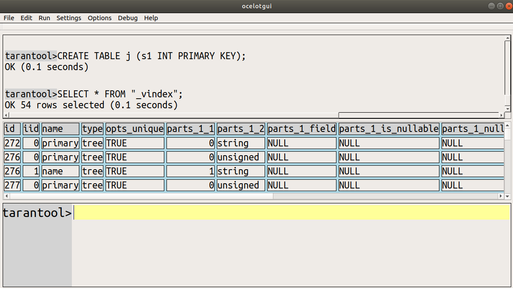</A>
 

By the way, notice that ocelotgui has "flattened" some maps and arrays in "_vindex".
Flattening is a necessary enhancement for a Tarantool client because otherwise
the result set would not be tabular when selecting from a Lua space.

  

<H3 id="menu">Menu</H3>

The menu at the top of the screen has File, Edit, Run, Settings,
Options, Debug and Help.

<A href="menu-file.png">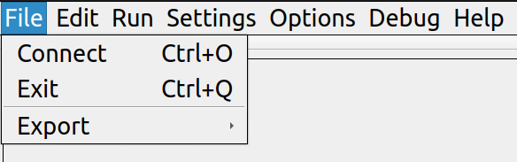</A>
File|Connect, or Ctrl+O, starts the Connect dialog box.  
File|Exit, or Ctrl+Q, stops the program.
File|Export brings up a dialog box for exporting selections.
 

<A href="menu-edit-tarantool.png">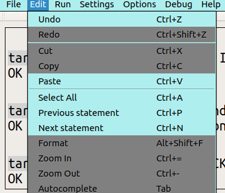</A>
Edit|Undo or Ctrl+Z, Edit|Redo or Ctrl+Shift+Z, Edit|Cut or Ctrl+X,
Edit|Cut or Ctrl+X, Edit|Copy or Ctrl+C, Edit|Paste or Ctrl+V,
and Edit|Select or Ctrl+A, all work in the conventional manner.
Edit|Redo can only redo the last change.  
Previous Statement or Ctrl+P and Next Statement or Ctrl+N will
copy earlier statements from the history widget into the statement
widget, so that they can be edited or re-executed with Run|Execute
or Ctrl+E. Format or Alt+Shift+F changes what is in the statement
widget according to a simple style guide. Autocomplete or Tab will
be discussed later.
 

<A href="menu-run.png">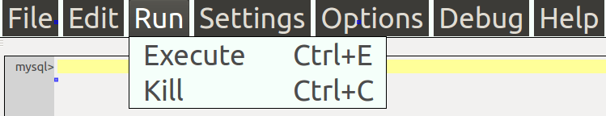</A>
Run|Execute or Ctrl+E or Ctrl+Enter causes execution of whatever is in the
statement widget.  
Run|Kill or Ctrl+C tries to stop execution -- this
menu item is disabled for Tarantool.
 

<A href="menu-settings.png">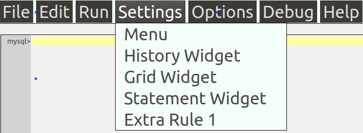</A>
Settings|Menu, Settings|History Widget, Settings|Grid Widget,
Settings|Statement, and Settings|Extra Rule 1 are
items which affect the behavior of each
individual widget. The color settings affect foregrounds,
backgrounds, borders, and (for the statement widget only)
the syntax highlights. The font settings affect font family,
boldness, italics, and size.
There may be additional choices affecting appearance,
for example the width of the border used to drag columns
in the result widget.
Settings|Extra Rule 1 is conditional -- for example, to specify
that varbinaries should be displayed as images on a pink background,
set Grid Background Color Pink, set Condition = data_type LIKE
'%BINARY', set Display As = image, then click OK.
 

<A href="menu-options.png">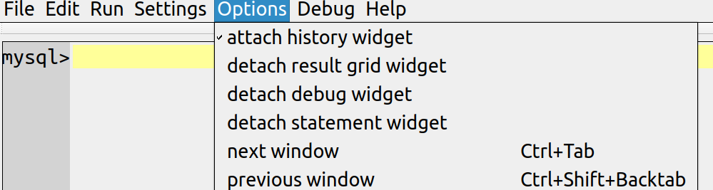</A>
Options|detach history widget,
Options|detach result grid widget,
Options|detach debug widget are
for turning the respective widgets into independent windows,
so that they can be moved away from the statement widget,
or resized. A detached widget is always kept on top of the
other widgets in the application screen. When a widget is
already detached, the menu item text will change to "attached"
and clicking it will put the widget back in its original position.
 

<A href="menu-debug.png">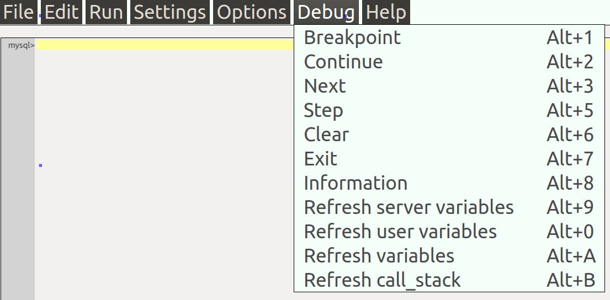</A>
The items on the Debug menu are disabled for Tarantool.
 

  

<A href="menu-help.png">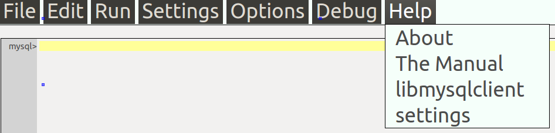</A>
Help|About will show the license and copyright and version.
Help|The Manual will show the contents of README.md (not the manual that you are reading) if README.md is on the same path as
the ocelotgui program; otherwise it will show a copyright, a GPL license, and a pointer to README.md.
Help|libmysqlclient is not relevant for Tarantool.
Help|settings will advise about how to use the Settings menu items.
 

<H3 id="special-effects">Special Effects</H3>

<A href="special-vertical-tarantool.png">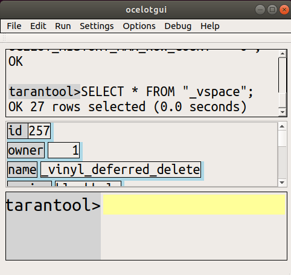</A>
> Vertical: If a user starts ocelotgui with the additional option --vertical=1,
> results come up with one column per row.
> (There are other options for displaying as html, raw, etc.).
  

  

<A href="special-images.png">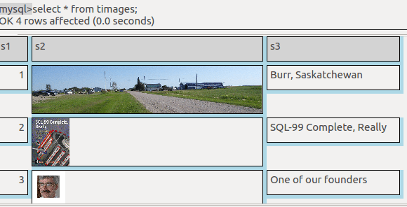</A>
Images: If a user chooses Settings | Extra Rule 1 from the menu,
and sets the Condition and Display As boxes as described earlier,
and selects rows which contain VARBINARY columns, and the column values are
images (such as PNG or JPEG or BMP or GIF format data), ocelotgui will display
the result as images.  
 

Result-set editing: If a user clicks on a column in the result set
and makes a change, an update statement will appear in the statement widget.
For example, if a result set is the result from SELECT column1, column2 FROM t;,
and the column1 value is 5, and the column2 value is 'ABC', and the user changes
the column2 value to 'AB', then the
statement widget will show UPDATE t SET column2 = 'AB' WHERE column1 = 5 AND column2 = 'AB';.
The user then has the choice of ignoring the update statement or executing it.  

<A href="special-detach.png">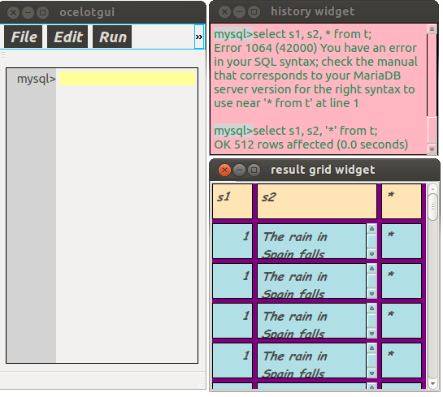</A>
Detaching: If a user chooses Options | detach history widget or
Options | detach result grid widget, then the widget will become a separate window
which can be moved or resized.  
 

<A href="special-settings.png">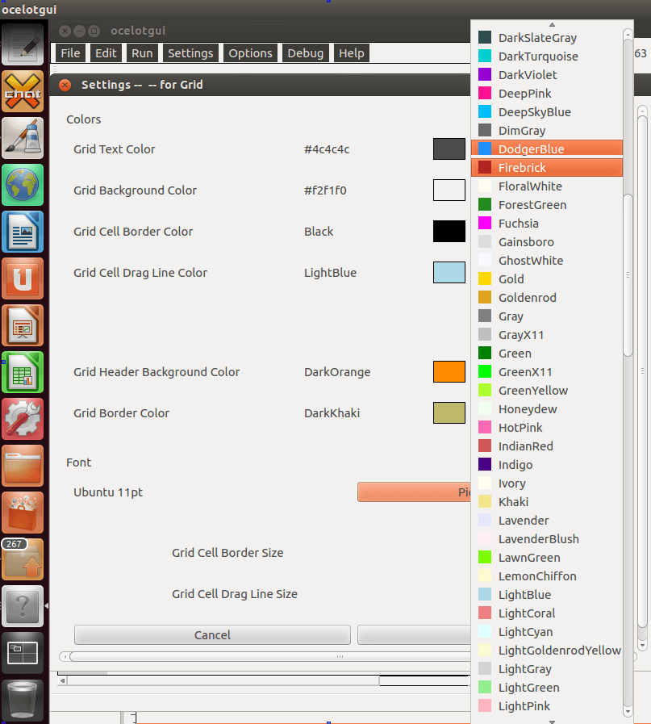</A>
Colors: The Colors and fonts dialog boxes have a simple way to choose
colors, by selecting from a choice of 148 color names / color icons. Users can also
change colors by saying SET object_name_color = color-name | hex-rgb-value.  
In fact ocelotgui mixes the modes: for example if a user chooses Settings | Grid Text Color,
then clicks on the 'Red' icon, then clicks OK, ocelotgui generates a
statement "SET ocelot_grid_text_color = 'Red';". This makes the instruction
easy to repeat or put in a script.
 

RE: AUTOCOMPLETION. While a user is entering an SQL statement,
ocelotgui will display a list of possible words that may follow.
Hitting the Tab key will cause the first word in the list to be
displayed and accepted.
Users can use arrow keys to select other words,
and can use "set ocelot_shortcut_autocomplete='...'; to choose a different key instead of the Tab key,
and can use "set ocelot_completer_timeout=...'; to choose how many seconds the list will be visible,
and can use "rehash;" to update the list. 
<A href="completer_1-tarantool.png">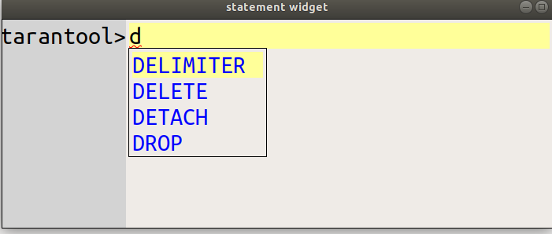</A> 
<A href="completer_2-tarantool.png">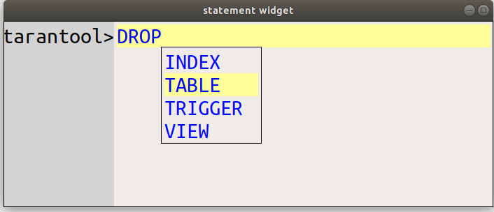</A> 
<A href="completer_3-tarantool.png">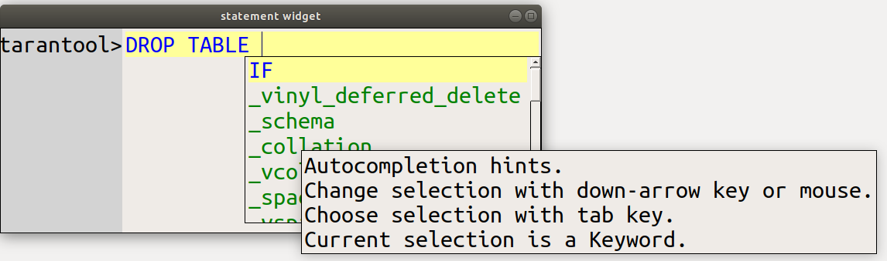</A>

RE: HINTING FOR COLUMN NAMES. Although hints for syntax appear by
default, hints for table / column identifiers might not. In order to
make identifiers appear on the hint list: (1) ensure the setting
for auto_rehash has not been turned off, and/or (2) enter the statement
"REHASH;" to make the client ask the server for a list of identifiers
in the current database; (3) when entering an SQL statement, type `
(backtick) at the point where an identifier is expected.

RE: FONT. By default, ocelotgui uses a fixed-pitch (mono) font that
has similar attributes to whatever font was in use
at the time it started. This may be a bad choice.
We recommend trying out other fonts with the Settings menu
for each widget.

RE: PERMANENT CUSTOMIZING. Changes to settings can be done
with the Settings menu items, but such changes are not permanent.
So note the commands that ocelotgui performs when settings are
changed, and paste them into a file. Later this file can be
executed (for example with SOURCE file-name), whenever ocelotgui
is started again. Alternatively, settings can be placed in
an options file such as my.cnf.

<A href="special-settings.png">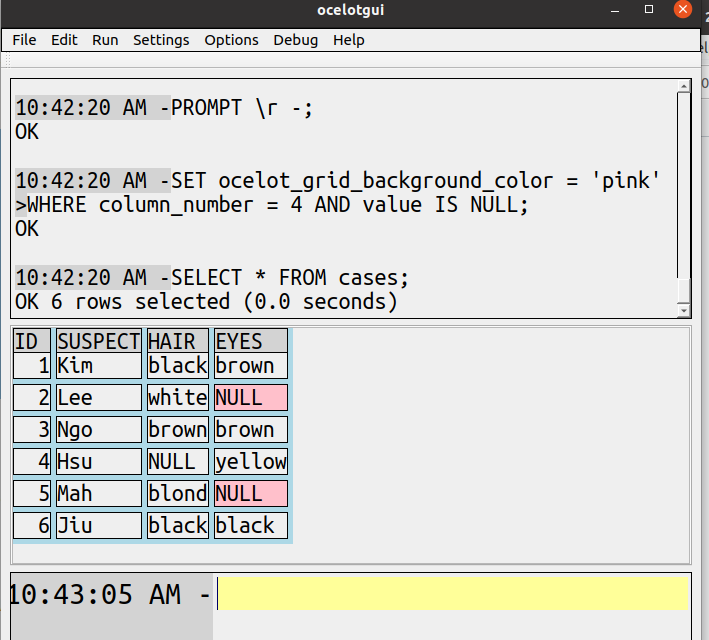</A>
RE: CONDITIONAL SETTINGS. To override the ordinary <A HREF="#special-settings">settings</A>
for result set displays there is a special SET statement with a WHERE clause: 
SET ocelot_grid_setting = string|integer [, ocelot_grid_value = string-or-integer...] 
WHERE condition [AND|OR condition ...]; 
where ocelot_grid_setting is OCELOT_GRID_BACKGROUND_COLOR | OCELOT_GRID_FONT_STYLE |  etc., 
and condition has the form item comparison-operator literal, where
item is COLUMN_NAME | COLUMN_NUMBER | COLUMN_TYPE | ROW_NUMBER | VALUE, 
and comparison-operator is = | > | >= | < | <= | <> | IS | REGEXP. 
For example to say "I want the background color to be pink if
it's in the fourth column of the result set and it's NULL", say 
SET ocelot_grid_background_color='pink' WHERE column_number = 4 AND value IS NULL;".

RE: CONNECTION DIALOG. As stated earlier, if a password is necessary
to connect, it is sufficient to start ocelotgui with "--password=<i>password</i>"
or by choosing File|Connect and typing a password in the Password
field (the sixth field in the Connection Dialog Box). Also on the
Connection Dialog Box, if the server is running on the same computer
as the ocelotgui client, it is sometimes a good idea to enter
'127.0.0.1' in the host field, instead of 'localhost'.

RE: HOVERING. Use the mouse to hover over a word in the
statement widget, and ocelotgui will display what kind of word
it is, for example "table identifier".
<A href="hover-tarantool.png">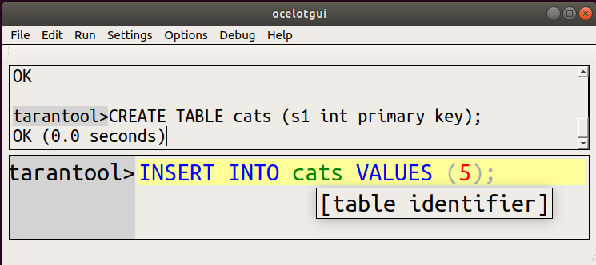</A>

RE: FORMAT. Click Edit|Format, and ocelotgui will change the contents of
the statement widget so that keywords are upper case and
sub-clauses or sub-statements are indented.

RE: HISTORY. By default the history does not contain any rows
from result sets of previous statements. To change this, click
Settings|History and enter a number for Max Row Count.
Also users can change the history file name with HISTFILE=name,
change what statements should not go to the ihstory file with HISTIGNORE=regexp,
change whether the history file will include system-generated comments with OCELOT_HISTFILEFLAGS='L'|'LP',
change how large the history file can become with OCELOT_HISTFILESIZE=number,
change how large the initial history can become with OCELOT_HISTSIZE=number.

RE: EXPORT. A result set can be dumped to a file as text, as table, or as html.

RE: TARANTOOL EXTRAS. There are a few other Tarantool-specific features
that have to be regarded as "in development" rather than "everyday use".
For example you can enter Lua statements as well as SQL statements.
Read <A HREF="#Appendix-3">Appendix 3 Tarantool Extras</A>.

<H3 id="explorer-widget">Explorer widget</A></H3>

EXPLORER NAME. Explorer.
A similar feature in other GUI clients may be named "object explorer" or "navigator".
Compare the name "Windows explorer".
Note: this section has some MySQL/MariaDB output examples but the feature works with Tarantool too.

EXPLORER SETTINGS.
To change some significant settings, click on the menu bar: Settings|Explorer. 
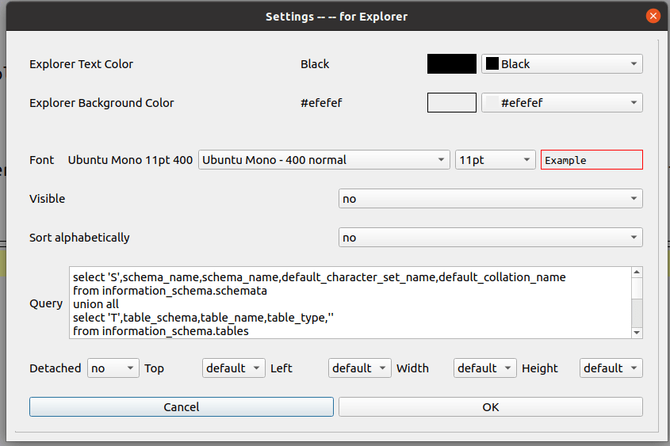
Visible: yes|no. Default no. So if you don't change this to 'yes', it is not visible.
There must be a connection to the DBMS server before it can be made visible. 
Sort alphabetically: yes|no. Default no. If 'yes', objects of the same type are sorted alphabetically. 
Query: a long select with unions.
The default query selects all databases.
Users can change this query to add WHERE clauses (affects MySQL/MariaDB only). 
Detached|Top|Left|Width|Height:
As with other widgets, the explorer is detachable and the explorer's size + position are settable
when it is detached.
Unlike with other widgets, changing width may have an effect even if the explorer is not detached.
The default width depends on the widths of the object names.

Ordinarily the explorer widget appears on the left while the other main widgets
(history, grid, statement) appear vertically on the right.

EXPLORER STYLE. It is a result grid with text columns.
Therefore users get some features without needing to learn anything new: 
* ^Find works. (if the item is visible) 
* Vertical scroll bar works. 
* Settings | Explorer can be used to change colors and font. 
* Example: SET ocelot_explorer_text_color='blue' WHERE value = '▶'; REFRESH; 

EXPLORER COLUMNS. There are three text columns. 
#1: Min. = Unicode Black Down-Pointing Triangle ▼ or Black Right-Pointing Triangle ▶ if database or table.
If it's a database or table, click on the triangle to hide the parts e.g. columns, or to show them again.
(This is "toggling".)
It's treated as a header item, that is, Result Grid Settings for header affect it.
So ordinarily it has a different background color. 
#2: object_type. = S or T or V or C or P or I or E or t 
#3: object_name. for example, if object_type='T', this is a table name. 
If object_type='C', this is a column name and is taken from part_name.

EXPLORER ROWS.
Rows are in a hierarchy: S, T or V, C or I, etc.
Within the hierarchy, rows are in order by creation time.

EXPLORER POSSIBLE USER ACTIONS 
Hover. This will show what type of object is under the cursor and contain some short advice. 
DoubleClick: This will copy the cell contents to the end of the statement widget 
Right Click: puts up a context menu. 
Click on the leftmost (Min) column. This will "toggle".

EXPLORER CONTEXT MENU.
This is the menu that will appear when the user uses the right mouse button to click
over a row in the explorer display.
It is called a context menu because the menu is different for each object type.
For example if it's over a table, then table-related menu items will appear. 
Items for all types: Copy to clipboard, Send to SQL editor, Reset, Refresh. 
Items for 'S' (Schema): Set as default schema, Filter to this schema, Schema inspector,
Create schema, Alter schema, Drop schema. 
Items for 'T' (Table): Select rows, Export dialog - Text, Export dialog - Table,
Export dialog - Html, Import - Text, Create table, Create table like, Drop table, Truncate table. 
For 'C' (Column): Show column, Drop column. 
For 'I' (Index): Show index, Select index, drop index. 
For 'P' (Procedure): Create procedure, Drop procedure. 
Details for 'T':
<pre>
  Copy to Clipboard      Equivalent of "Copy"
  Send to SQL editor     Copy, then put in statement widget, then execute
  Select rows            Execute a statement to select 100 rows
  Export Dialog - Text   Dialog box for export, then do the export if OK
  Export Dialog - Table  Dialog box for export, then do the export if OK
  Export Dialog - Html   Dialog box for export, then do the export if OK
  Import - Text          Generate INSERTs for a file's contents, no options
  Create table           Generate SHOW CREATE TABLE ...
  Create table like      Generate CREATE TABLE ... LIKE ...
  Drop table             Generate DROP TABLE
  Truncate table         Generate TRUNCATE TABLE
  Reset                  Back to default state with nothing expanded
  Refresh                Big SELECT to recreate the widget (this can be slow)
</pre>

EXPLORER EXAMPLE. 

The user makes the explorer visible with Settings|Explorer Widget, it looks like this: 
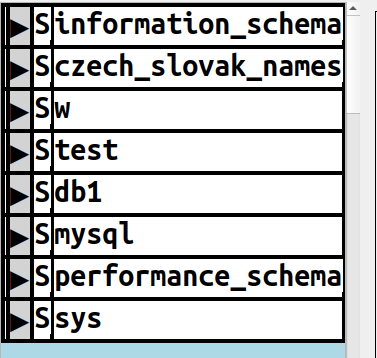 
The user clicks the ▶ beside information_schema, it changes to ▼
and the schema items appear: 
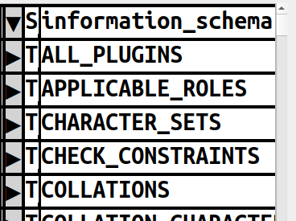 
The user right-clicks on COLLATIONS, and the context menu appears: 
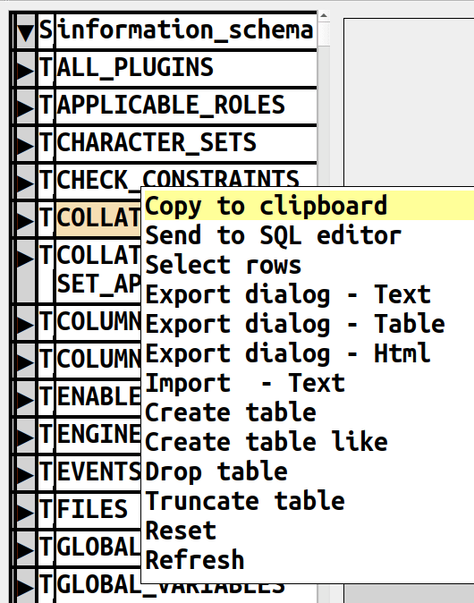 
The user navigates (with the mouse or the down-arrow key) and selects
(with Enter or Tab or click) the Export dialog - Text choice, and
the export dialog appears: 
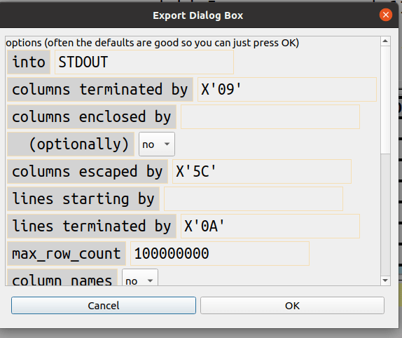 
The user selects the OK button and the contents are dumped to STDOUT: 
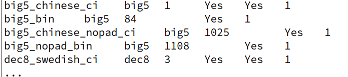 

EXPLORER SET STATEMENTS.
The user can enter SET statements on the select widget.
Or, some SET statements will be generated when the user clicks OK on the Settings menu. 
Keywords are
OCELOT_EXPLORER_ACTION,
OCELOT_EXPLORER_APPLICABLE_DBMSS,
OCELOT_EXPLORER_APPLICABLE_TYPES,
OCELOT_EXPLORER_BACKGROUND_COLOR,
OCELOT_EXPLORER_DETACHED,
OCELOT_EXPLORER_ENABLED,
OCELOT_EXPLORER_FONT_FAMILY,
OCELOT_EXPLORER_FONT_SIZE,
OCELOT_EXPLORER_FONT_STYLE,
OCELOT_EXPLORER_FONT_WEIGHT,
OCELOT_EXPLORER_HEIGHT,
OCELOT_EXPLORER_LEFT,
OCELOT_EXPLORER_SHORTCUT,
OCELOT_EXPLORER_TEXT,
OCELOT_EXPLORER_TEXT_COLOR,
OCELOT_EXPLORER_TOP,
OCELOT_EXPLORER_VISIBLE,
OCELOT_EXPLORER_WIDTH. 
The important one is SET ocelot_explorer_visible='yes'; 
Settings can also be done in the .cnf file or the command line,
for example start ocelotgui with --ocelot_explorer_visible='yes'. 
Such statements affect both the explorer widget and its context menu.
Note: some settings changes do not take effect immediately, they are delayed until "Refresh" happens. 

EXPLORER CONDITIONAL SET STATEMENTS.
There is an optional clause ... WHERE VALUE operator 'literal' [{AND|OR} value operator 'literal' ...].
Statements with WHERE clauses affect only rows which match the expression.
Example: 
SET ocelot_explorer_background_color='blue' WHERE value > 'p' OR value regexp '1'; 
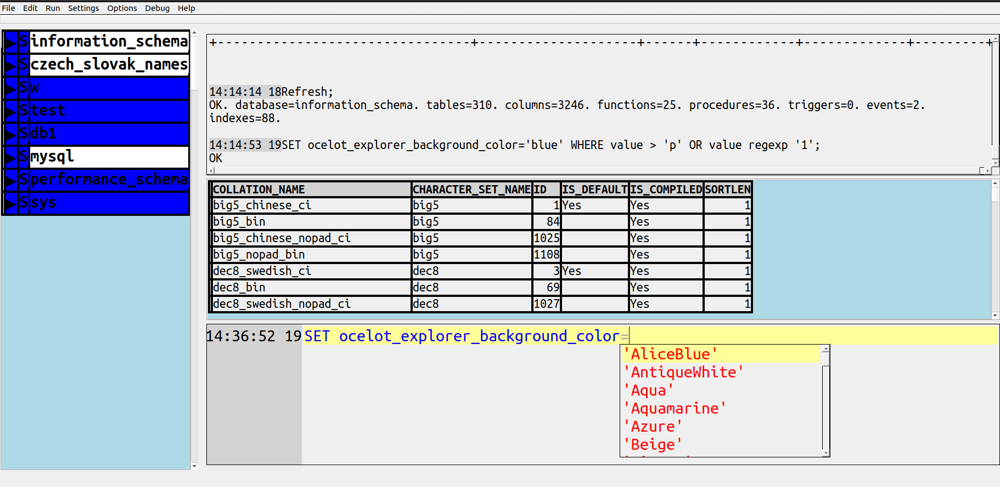 

EXPLORER REFRESH STATEMENT.
REFRESH is a bit similar to REHASH, but it gets all schemas (databases)
-- so has an effect on the server.
REFRESH is necessary because we don't know when other users might change data definitions.
And it's slow.
Whenever users say REFRESH, the explorer tables are redone.

EXPLORER IN OPTIONS MENU. Choosing Options|Detach explorer widget,
and rearranging widgets, could result in something like this: 
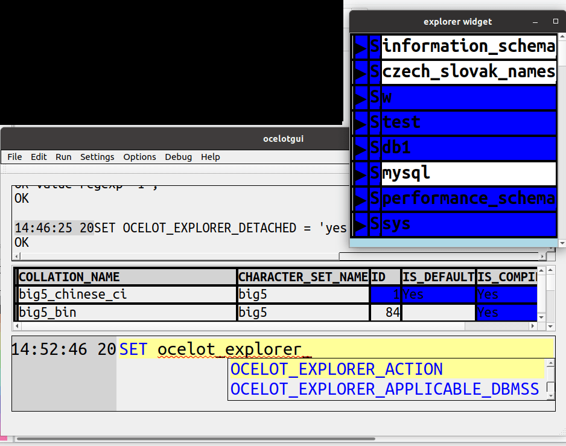 

EXPLORER ADVANCED-LEVEL CUSTOMIZING.
As explained earlier, customizing the appearance of the explorer widget
and the context menu, or specific rows on them, is simple
and somewhat like the customizing of the other widgets.
However, one can do more with the context menu -- change the text and
action and shortcut. 
Here, for example, is a statement that says
there will be a shortcut associated with the Refresh option: 
SET ocelot_explorer_shortcut='Alt+G' WHERE value = 'Refresh'; 
Here, for example, is a statement that says
"Instead of 'Create table', the 'T' menu choice will be
'Select Count(*)' and the effect, if you click it,
or type the shortcut key, will be that the
statement "SELECT COUNT(*) FROM (table-name-in-context);" will appear on the statement widget,
where it is executed, so the result count appears in the grid widget. 
SET ocelot_explorer_action='SELECT COUNT(*) FROM ${object_name};',
 ocelot_explorer_text='Customized Selection'
WHERE value = 'Create table'; 
In other words, users can write their own explorer widgets. 
Many of the possible actions can have "macros"
-- strings enclosed inside ${...} that will be replaced when the statement is executed.
Some macros are:
... ${dialog-table} ${dialog_file} ${occurs_text} ${schema_name} ${object_name}
'${object_name}' ${part_name} ${unqualified_part_name} '${part_name}'
${part_type} ${cell} ${clipboard} ${action}.
Since ocelotgui source code is supplied, users can
download it and see the exact effects by reading the C++ statements in program ocelotgui.cpp,
function Context_menu::replacer(). 

<H3 id="ERDiagram">ERDiagram</H3>

An entity relationship diagram ("ERDiagram") is a graphic display of tables (in rectangles) and foreign-key relationships
(as lines). The prerequisite is the existence of an explorer widget, that is, 
SET ocelot_explorer_visible='yes'; 
is necessary before requesting an ERDiagram.
An ERDiagram may either be requested from the explorer or from the statement widget.
When it's requested from the statement widget, the syntax is: 
SET OCELOT_QUERY = SHOW ERDIAGRAM OF schema_name [COLUMNS PRIMARY] [LINES IN BACKGROUND] [TABLES (table-list]; 
For example, to get the picture shown here, if you have the well-known "sakila" database, say 
SET OCELOT_QUERY = SHOW ERDIAGRAM OF sakila COLUMNS PRIMARY; 

The optional clause COLUMNS PRIMARY means "show only the columns which are part of a primary key instead of all columns",
the optional clause LINES IN BACKGROUND means "draw lines underneath tables instead of over them",
the optional clause TABLES (table-list) means "show only the tables in this list instead of all tables".
The table list should be a comma-delimited list of table names and each name can be followed by x and y coordinates,
for example "TABLES (customer 0 1, address 1 1" means "display customer in column 0 row 1 and display address in
column 1 row 1".

Customize the display fonts and colors with SET OCELOT_GRID_... statements, for example
SET OCELOT_GRID_FONT_WEIGHT='bold' WHERE value REGEXP '_id'; will cause column names which end with _id
(the primary keys) to be displayed with a bold font. Move a mouse over a line to see the foreign key name.

<H3 id="charts">Charts</H3>

While a result set is visible, if some columns are numeric, press Alt+Shift+B to
display as a bar chart, Alt+Shift+P to display as a pie chart, Alt+Shift+L to display as a line chart. 
No plugins or separate programs are necessary.
But to customize the look of the charts, you will need client statements.

The basic statement syntax is 
SET ocelot_grid_chart = 'literal' [WHERE clause]; 
After you've typed SET ocelot_grid_chart = the prompt/autocomplete list wil be
BAR | LINE | PIE | BAR VERTICAL | BAR STACKED | BAR VERTICAL STACKED | BAR SUBGROUP BY VALUE % 3
| BAR SUBGROUP BY LEFT(COLUMN_NAME, 2) | LINE SUBGROUP BY LEFT(COLUMN_NAME, 2) | PIE SUBGROUP BY LEFT(COLUMN_NAME, 2) | [string]
-- and you can make your own combination for example 
SET ocelot_grid_chart = 'BAR STACKED SUBGROUP BY VALUE % 5'; 
The optional WHERE may include COLUMN_NAME | COLUMN_NUMBER | COLUMN_TYPE
(relational operator) (literal value), along with AND|OR, as is usual for
any SET OCELOT_GRID_... statements. For example 
SET OCELOT_GRID_chart = 'PIE' WHERE column_name = 'k'; 
SET ocelot_grid_chart=''; will cancel all previous uses of SET ocelot_chart_grid,
that is, it turns the feature off.

Shortcut key combinations are: 
Alt+Shift+B causes SET ocelot_grid_chart='bar'; 
Alt+Shift+L causes SET ocelot_grid_chart='line'; 
Alt_Shift+P causes SET ocelot_grid_chart='pie'; 
Alt+Shift+N causes SET ocelot_grid_chart=''; 
As usual, it is possible to change the key combinations with
SET ocelot_shortcut... statements.

GROUPS: Charts make sense when representing numbers.
A "group" is any uninterrupted series of numbers in a result-set row.
For example, in 
SELECT 'a',1,2,3.7,4,'b',5e1,6,'c'; 
the first group is 1,2,3.7,4 and the second group is 5e1,6.
(That is the default. to change the default, use a WHERE clause.)

SUBGROUPS. A group may be divided into subgroups.
Subgrouping is what decides how sampling is done within a group.
Different methods of subgrouping are appropriate for different
types of chart. 
There is automatic subgrouping of pies because otherwise all
pie segments would have a single colour.
(Different subgroups have different colours.) 
There is automatic subgrouping of lines because otherwise the
points of all lines would be in the same axis and there would
be no apparent movement. The automatic subgrouping in this case
is SUBGROUP BY LEFT(COLUMN_NAME,2) so it need not be specified.

LAYOUT OF A CELL. (After header, not including cell border.)<pre>
  +--------------------------------------------------+
  |    TOP                                           |
  |L |                                              L|
  |E |   CANVAS                                     E|
  |F |                                              G|
  |T |                                              E|
  |  |                                              N|
  |  |                                              D|
  |   _____________________________________________  |
  |   BOTTOM                                         |
  +--------------------------------------------------+
</pre>
But if cell size is small ocelotgui might cancel everything except the canvas. 
CANVAS: is a non-optional component, it has the actual bar/line/pie chart. 
LEGEND: is on the RIGHT. Icons and very short text. 
TOP: text (not shown by default). 
LEFT: For vertical-bar or line has "values axis", for horizontal-bar has "samples axis". Text, rotated 90 degrees. 
LEFT LINE: a straight line between LEFT and canvas. 
BOTTOM: For horizontal-bar or line has "values axis", for vertical-bar has "samples axis". Text. 
BOTTOM LINE: a straight line between canvas and BOTTOM. 
Values axis: Becomes next to LEFT or BOTTOM in a bar or line. 
Samples axis: Becomes next to LEFT or BOTTOM in a bar or line. 

It is possible to cancel or change any item except the canvas.
So a fuller statement of the SET syntax can be<pre>
  SET ocelot_grid_chart = '
  {BAR|LINE|PIE}          currently default=bar if this is missing, but don't do it
  [VERTICAL]                        default is horizontal
  [STACKED]                         default is grouping
  [TOP=value]                       default is null
  [RIGHT=value|LEGEND|NULL]         default is LEGEND
  [LEFT=value|DEFAULT|NULL]         default is DEFAULT
  [BOTTOM=value|DEFAULT|NULL]       default is DEFAULT
  [AXIS=NULL|ALL]                   default is ALL, anything but NULL will make axes appear
                         '
  WHERE condition];</pre>
For example, to suppress everything except the canvas with a vertical bar chart: 
SET ocelot_grid_chart='BAR VERTICAL RIGHT=NULL LEFT=NULL BOTTOM=NULL AXIS=NULL'; 
For example, to add a top line along with the other components with a pie: 
SET ocelot_grid_chart='PIE TOP=TOPPER'; 

EFFECTS OF OTHER SETTINGS: 
SET ocelot_grid_font=... affects what font the text items have. 
SET ocelot_grid_cell_border_size=... affects the width of lines. 
And other ocelot_grid settings may affect all cells including cells with charts. 
Any item value might be truncated. An easy way to change width of a single chart
is to use long column names, that is, instead of saying SELECT 1, 2, 3; say 
SELECT 1 AS really_long_column_name, 2, 3; 
but for some charts it is possible to use "SET ocelot_grid_cell_width=..." instead.

ILLUSTRATIONS. Pictures showing effects are in a blog post:
<a href="http://ocelot.ca/blog/blog/2023/08/08/charts/">Charts</a>.
The current output may look slightly different from the illustrations there,
and the Qwt library is no longer necessary.

<H3 id="contact">Contact</H3>

We need feedback!

Registered github users can simply go to
<A HREF="https://github.com/ocelot-inc/ocelotgui">https://github.com/ocelot-inc/ocelotgui</A>
and click the "Star" button.

Send bug reports and feature requests to
<A HREF="https://github.com/ocelot-inc/ocelotgui/issues">https://github.com/ocelot-inc/ocelotgui/issues</A>.
Or send a private note to pgulutzan at ocelot.ca.

There may be announcements from time to time on Ocelot's
web page (ocelot.ca) or on the employee blog (<A HREF="http://ocelot.ca/blog">http://ocelot.ca/blog</A>).

Any contributions will be appreciated.

<H3 id="Appendix-1">Appendix 1 Details about ocelotgui options</H3>

An option is a named value which affects connecting and behavior.
Most [ocelot] options are very similar to options of the mysql client.
  
The places that an option might be specified are:
within the program for example the default port value is 3306,
in an environment variable for example "export MYSQL_TCP_PORT=3306",
in a configuration file for example "port=3306" in $HOME/.my.cnf,
on the command line for example "./ocelotgui --port=3306",
or on the File|Connect dialog box.
  
Environment Variables. The ocelotgui program will look at these variables:
HOME, LD_RUN_PATH, MYSQL_GROUP_SUFFIX, MYSQL_HISTFILE,
MYSQL_HISTIGNORE, MYSQL_HOST, MYSQL_PS1, MYSQL_PWD.
MYSQL_TCP_PORT, MYSQL_UNIX_PORT, MYSQL_TEST_LOGIN_FILE.
  
Option Files: The ocelotgui program will look in these option files:
/etc/my.cnf, /etc/mysql/my.cnf, [SYSCONFDIR]/my.cnf,
[defaults-extra-file], $HOME/.my.cnf, $HOME/.mylogin.cnf.
Within option files, the ocelotgui program will look
in these groups: [client] [mysql] [ocelot], as well
as groups specified by MYSQL_GROUP_SUFFIX.
On Windows, the order is different: %system, %windir,
[application-directory], %MYSQL_HOME%, [defaults-extra-file].
  
Command Line: The ocelotgui program will look at command-line arguments
which are specified in short form such as "-P 3306", or
which are specified in long form such as "--port=3306".
  
Dialog Box: A dialog box will appear if the user enters a user statement
"CONNECT;" or if the user chooses menu item File|Connect.
The user will be advised to do this at startup time if an
initial attempt to connect fails.
  
Example
 
The default value for "port" is 3306, this is
hard coded in the ocelotgui source. 
The environment variable value for "port" is 3307, this is
set by "export MYSQL_TCP_PORT=3307" before starting ocelotgui. 
The option file value for "port" is 3308, this is
set by putting "PORT=3308" in the [mysql] group in
the $HOME/.mysql.cnf file. 
The command-line value for "port" is 3309, this is
set by putting "--port=3309" on the command line
when starting the ocelotgui program. 
The dialog-box value for "port" is 3310, this is
set by choosing File|Connect, entering "3310" in
the widget labelled "Port", and clicking "OK". 
The ocelotgui program reads the settings in the
above order, therefore the port number is 3310.
  
Options in the following table are in the same order that one sees
on the File|Connect dialog box: first come the 8 important connect
options (including host, port, user, database, password,
init_command), then all the other options in alphabetical order. 
Unless otherwise stated, options are specifiable by saying 
[option_name] = [value] in an option file or 
--[option_name] = [value] on the command line 
(sometimes --[option_name] alone is sufficient for true|false values),
or in the dialog box. 
If an option value is irrelevant or invalid, the ocelotgui program
ignores it without displaying an error message.

 <table border="1" style="width:100%;background-color: #f1f1c1">
 <tr>
 <th>Option</th>
 <th>Description</th>
 </tr>
 <tr>
 <td valign="top">host</td>
 <td valign="top">Server address. Specifiable with MYSQL_HOST
environment variable, with host= in an option file, with
-h or --host on the command line, or in dialog box.
Example values: localhost 192.15.8.44 w@ww.com.
Warning: if host=localhost, ocelotgui tries to use a socket,
if this is not desirable then say localhost=127.0.0.1 instead.</td>
 </tr>
 <tr>
 <td valign="top">port</td>
 <td valign="top">Port that the server listens on, if the protocol is
TCP. Specifiable with
MYSQL_TCP_PORT environment variable, with port= in an option
file, with -P or --port on the command line, or in dialog box.
Example values: 3306 3307.</td>
</tr>

<tr>
<td valign="top">user</td>
<td valign="top"> User name. Specifiable with user= in an option file,
with -u or --user on the command line, or in dialog box.
Example values: root guest jsmith.</td>
</tr>

<tr>
<td valign="top">database</td>
<td valign="top">Database name also known as schema name. Specifiable
with database= in an option file, with -D or --database on the
command line, or in dialog box. Example values: test account_data.
</td>
</tr>

<tr>
<td valign="top">socket</td>
<td valign="top">Socket name that the server receives on, if the
protocol is SOCKET. Specifiable with socket= in an option file,
with -S or --socket= on the command line, or in dialog box.
Examples: var/lib/special.sock /home/user/x.sock.
</td>
</tr>

<tr>
<td valign="top">password</td>
<td valign="top">Password associated with the user. Specifiable
with password= in an option file, with -p or --password= on
the command line, or in dialog box. If the password is
required but not specified, the dialog box will always appear.
Examples: sesame top_secret#1</td>
</tr>

<tr>
<td valign="top">protocol</td>
<td valign="top">How the connection to the server occurs. Possible
values are: blank or TCP or SOCKET. If host=localhost and
protocol is blank, then SOCKET is assumed. Specifiable with
protocol= in an option file, with --protocol= on the command
line, or in dialog box. Examples: tcp socket.</td>
</tr>

<tr>
<td valign="top">init_command</td>
<td valign="top">Initial statement that should be executed as
soon as connect is complete. Example: "select current_user()".</td>
</tr>

<tr>
<td valign="top">auto_rehash</td>
<td valign="top">If 1 (true), ocelotgui may try to
complete names.</td>
</tr>

<tr>
<td valign="top">auto_vertical_output</td>
<td valign="top">If 1 (true), ocelotgui will display
with one column per row.</td>
</tr>

<tr>
<td valign="top">batch</td>
<td valign="top">Mostly ignored, but if 1 (true), history is not written.</td>
</tr>

<tr>
<td valign="top">compress</td>
<td valign="top">If 1 (true), value is passed to the server.</td>
</tr>

<tr>
<td valign="top">connect_expired_password</td>
<td valign="top">If 1 (true), ocelotgui goes into
sandbox mode if a password has expired at connect time.</td>
</tr>

<tr>
<td valign="top">connect_timeout</td>
<td valign="top">Ignored.</td>
</tr>

<tr>
<td valign="top">debug</td>
<td valign="top">Ignored.</td>
</tr>

<tr>
<td valign="top">debug_check</td>
<td valign="top">Ignored.</td>
</tr>

<tr>
<td valign="top">debug_info</td>
<td valign="top">Ignored.</td>
</tr>

<tr>
<td valign="top">default_auth</td>
<td valign="top">Ignored.</td>
</tr>

<tr>
<td valign="top">default_character_set</td>
<td valign="top">Ignored, ocelotgui needs UTF-8.</td>
</tr>

<tr>
<td valign="top">defaults_extra_file</td>
<td valign="top">Name of an additional option file.</td>
</tr>

<tr>
<td valign="top">defaults_file</td>
<td valign="top">Ignored.</td>
</tr>

<tr>
<td valign="top">defaults_group_suffix</td>
<td valign="top">Suffix that is added to the regular group
names for option files. For example, if defaults_group_suffix=_X,
then ocelotgui will look at options in groups client_X and mysql_X and
ocelot_X in addition to options in groups client and mysql and ocelot.</td>
</tr>

<tr>
<td valign="top">delimiter</td>
<td valign="top">What ends a statement, usually semicolon ";".</td>
</tr>

<tr>
<td valign="top">enable_cleartext_plugin</td>
<td valign="top">Ignored.
</tr>

<tr>
<td valign="top">execute</td>
<td valign="top">String to execute followed by program exit.</td>
</tr>

<tr>
<td valign="top">force</td>
<td valign="top">Ignored, ocelotgui always ignores errors in options.</td>
</tr>

<tr>
<td valign="top">help</td>
<td valign="top">Display a help message followed by program exit.</td>
</tr>

<tr>
<td valign="top">histfile</td>
<td valign="top">Name of file where statements are logged to, usually
".mysql_history". Ignored if batch=1. Ignored if
histfile=/dev/null.</td>
</tr>

<tr>
<td valign="top">histignore</td>
<td valign="top">Pattern to ignore when writing to histfile.
For example, if histignore is "*select*", then statements
containing the string "select" will not be written.
</tr>

<tr>
<td valign="top">html</td>
<td valign="top">Internally formats are HTML anyway even if one says
html=0, unless one starts with one of the non-HTML options such as
batch or xml. If one starts ocelotgui with --html --raw,
the actual html markup code will appear.</td>
</tr>

<tr>
<td valign="top">ignore_spaces</td>
<td valign="top">Ignored.</td>
</tr>

<tr>
<td valign="top">ld_run_path</td>
<td valign="top">Where to look for libmysqlclient.so. Click help|libmysqlclient
for details.</td>
</tr>

<tr>
<td valign="top">line_numbers</td>
<td valign="top">Ignored.</td>
</tr>

<tr>
<td valign="top">local_infile</td>
<td valign="top">If 1 (true), passed to the server.</td>
</tr>

<tr>
<td valign="top">login_path</td>
<td valign="top">Where to find login file if it's not "~/.mylogin.cnf".</td>
</tr>

<tr>
<td valign="top">max_allowed_packet</td>
<td valign="top">Passed to the server. Default 16777216.</td>

<tr>
<td valign="top">max_join_size</td>
<td valign="top">Passed to the server. Default 1000000.</td>
</tr>

<tr>
<td valign="top">named_commands</td>
<td valign="top">Ignored.</td>
</tr>

<tr>
<td valign="top">net_buffer_length</td>
<td valign="top">Passed to the server. Default 16384.</td>
</tr>

<tr>
<td valign="top">no_beep</td>
<td valign="top">Ignored, ocelotgui does not usually beep when errors occur.</td>
</tr>

<tr>
<td valign="top">no_defaults</td>
<td valign="top">If 1 (true), options in environment variables and option
files are read but not used.</td>
</tr>

<tr>
<td valign="top">ocelot_*</td>
<td valign="top">... Options that begin with "ocelot_" are only recognized
by the ocelotgui client. Everything on the Settings menu has an
associated option name. The intuitively-named settings options are:
ocelot_explorer_action ocelot_explorer_applicable_dbmss ocelot_explorer_applicable_types
ocelot_explorer_background_color ocelot_explorer_detached ocelot_explorer_enabled
ocelot_explorer_font_family ocelot_explorer_font_size ocelot_explorer_font_style
ocelot_explorer_font_weight ocelot_explorer_height ocelot_explorer_left
ocelot_explorer_shortcut ocelot_explorer_text ocelot_explorer_text_color
ocelot_explorer_top ocelot_explorer_visible ocelot_explorer_width
ocelot_extra_rule_1_text_color ocelot_extra_rule_1_background_color
ocelot_extra_rule_1_condition ocelot_extra_rule_1_display_as
ocelot_grid_text_color ocelot_grid_background_color
ocelot_grid_header_background_color
ocelot_grid_font_family ocelot_grid_font_size ocelot_grid_font_style
ocelot_grid_font_weight ocelot_grid_cell_border_color
ocelot_grid_cell_border_size ocelot_grid_detached
ocelot_grid_html_settings
ocelot_grid_left
ocelot_grid_top
ocelot_grid_width
ocelot_grid_height
ocelot_grid_focus_cell_background_color
ocelot_grid_outer_color
ocelot_grid_cell_height
ocelot_grid_cell_width
ocelot_grid_tabs
ocelot_grid_tooltip
ocelot_history_text_color ocelot_history_background_color
ocelot_history_border_color ocelot_history_font_family
ocelot_history_font_size ocelot_history_font_style
ocelot_history_font_weight ocelot_menu_text_color ocelot_history_detached
ocelot_menu_background_color ocelot_menu_border_color
ocelot_menu_font_family ocelot_menu_font_size
ocelot_menu_font_style ocelot_menu_font_weight
ocelot_statement_text_color ocelot_statement_background_color
ocelot_statement_border_color ocelot_statement_font_family
ocelot_statement_font_size ocelot_statement_font_style
ocelot_statement_font_weight ocelot_statement_highlight_literal_color
ocelot_statement_highlight_identifier_color ocelot_statement_highlight_comment_color
ocelot_statement_highlight_operator_color ocelot_statement_highlight_keyword_color
ocelot_statement_prompt_background_color ocelot_statement_highlight_function_color
ocelot_statement_highlight_current_line_color ocelot_statement_detached.
See also: the ocelot_ options which aren't related to Settings, below.</td>
See also: the example.cnf file.
</tr>

<tr>
<td valign="top">ocelot_client_side_functions</td>
<td valign="top"> ocelot_client_side_functions=0 turns off
the client-side functions, such as "select row_number() over ...".
This may be unnecessary with newer versions of MariaDB.
The default is 1.</td>
</tr>

<tr>
<td valign="top">ocelot_dbms</td>
<td valign="top">--ocelot_dbms=x means assume the server DBMS is x
until connection is made. The possible values are 'mysql',
'mariadb', and 'tarantool'. The default is 'mysql'.</td>
</tr>

<tr>
<td valign="top">ocelot_grid_tabs</td>
<td valign="top">ocelot_grid_tabs=5
means assume that a stored procedure can return up to 5 result sets.
The default is 16.</td>
</tr>

<tr>
<td valign="top">ocelot_language</td>
<td valign="top">--ocelot_language='english' means the menu and the
client error messages should be in English, --ocelot_language='french'
means the menu and the client error messages should be in French.
The default is 'english'.</td>
</tr>

<tr>
<td valign="top">ocelot_statement_syntax_checker</td>
<td valign="top">setting
ocelot_statement_syntax_checker=1 turns on the
syntax checker; setting ocelot_statement_syntax_checker=2
turns on the syntax checker and is insistent -- if ocelotgui
doesn't like the syntax checker, a confirmation dialog box
will appear. The default is 1.</td>
</tr>

<tr>
<td valign="top">ocelot_shortcut_*</td>
<td valign="top">ocelot_shortcut_connect, ocelot_shortcut_exit, etc. ...
You can change what the shortcut is, for any menu
item, by specifying its name and a new keysequence.
For example: SET ocelot_shortcut_paste = 'Ctrl+Shift+K';</td>
</tr>

<tr>
<td valign="top">one_database</td>
<td valign="top">Ignored.</td>
</tr>

<tr>
<td valign="top">pager</td>
<td valign="top">Ignored.</td>
</tr>

<tr>
<td valign="top">pipe</td>
<td valign="top">Ignored.</td>
</tr>

<tr>
<td valign="top">plugin_dir</td>
<td valign="top">Ignored.</td>
</tr>

<tr>
<td valign="top">print_defaults</td>
<td valign="top">If 1 (true), ocelotgui displays defaults and exits.</td>
</tr>

<tr>
<td valign="top">prompt</td>
<td valign="top">What to display on left of statement lines.
Default is "mysql>".
The prompt can include special character sequences
for date, time, and line number.</td>
</tr>

<tr>
<td valign="top">quick</td>
<td valign="top">Ignored.</td>
</tr>

<tr>
<td valign="top">raw</td>
<td valign="top">Ignored.</td>
</tr>

<tr>
<td valign="top">reconnect</td>
<td valign="top">Ignored.</td>
</tr>

<tr>
<td valign="top">safe_updates</td>
<td valign="top">If 1 (true), ocelotgui passes 1 to the server.</td>
</tr>

<tr>
<td valign="top">secure_auth</td>
<td valign="top">If 1 (true), ocelotgui passes 1 to the server.</td>
</tr>

<tr>
<td valign="top">select_limit</td>
<td valign="top">The maximum number of rows to select; default is 0
which means infinity; ocelotgui passes this to the server.</td>
</tr>

<tr>
<td valign="top">server_public_key</td>
<td valign="top">Ignored.</td>
</tr>

<tr>
<td valign="top">shared_memory_base_name</td>
<td valign="top">Ignored.</td>
</tr>

<tr>
<td valign="top">show_warnings</td>
<td valign="top">If 1 (true), ocelotgui displays warnings which
result from problems that the server detects.</td>
</tr>

<tr>
<td valign="top">sigint_ignore</td>
<td valign="top">If 1 (true), ocelotgui will not stop statements
when user types control-C or chooses the menu item Run|Kill.</td>
</tr>

<tr>
<td valign="top">silent</td>
<td valign="top">Ignored.</td>
</tr>

<tr>
<td valign="top">ssl_*</td>
<td valign="top">ssl, ssl_ca, ssl_capath, ssl_cert, ssl_cipher, ssl_crl,
ssl_crlpath, ssl_key, ssl_verify_server_cert. SSL options
are accepted and passed to the server.</td>
</tr>

<tr>
<td valign="top">syslog</td>
<td valign="top">Ignored.</td>
</tr>

<tr>
<td valign="top">table</td>
<td valign="top">Ignored.</td>
</tr>

<tr>
<td valign="top">tee</td>
<td valign="top">Name of a file to dump statements and results to.</td>
</tr>

<tr>
<td valign="top">unbuffered</td>
<td valign="top">Ignored.</td>
</tr>

<tr>
<td valign="top">verbose</td>
<td valign="top">Ignored.</td>
</tr>

<tr>
<td valign="top">version</td>
<td valign="top">If 1 (true), ocelotgui displays a version number and exits.</td>
</tr>

<tr>
<td valign="top">vertical</td>
<td valign="top">If 1 (true), results are displayed with one column
per line.</td>
</tr>

<tr>
<td valign="top">wait</td>
<td valign="top">Ignored.</td>
</tr>
<tr>
<td valign="top">xml</td>
<td valign="top">If one starts with ocelotgui --xml, the grid display will
show raw xml. See also --html.</td>
</tr>
</table>

<H3 id="Appendix-2">Appendix 2 Debugger</H3>

The reason that there is a menu item for a debugger is that ocelotgui
includes a debugger for SQL stored procedures.
The reason that the menu item is disabled is that Tarantool does not
support stored procedures. However, it is not impossible that this will
be enabled someday. For a look at one direction that development might
take, see the ocelot.ca blog post
<a href="http://ocelot.ca/blog/blog/2020/01/12/convert-sql-stored-procedures-to-lua-functions/">Convert SQL Stored Procedures to Lua Functions</a>.

<H3 id="Appendix-3">Appendix 3 Tarantool</H3>

The assumption is that users have a reasonably current
version of Tarantool as downloaded according to the instructions in
<A HREF="https://www.tarantool.io/en/download"> in the Tarantool manual</A>;
however, slightly earlier versions and slightly later versions will work.
The ocelotgui program will change its parsing to match the version.

The history widget can contain a copy of the result set,
if one clicks Settings | History Widget and sets a non-zero
in the Max Row Count box. The format looks like what comes
out of the mysql non-GUI table display to make copying easier.
This format might change to match the Tarantool console fselect display.

Usually you do not need to install the Tarantool client (libtarantool.so) library,
but it is possible to use it if you build ocelotgui with "cmake ... -DOCELOT_THIRD_PARTY=0".
If you did that, then this is how to get tarantool.so.
The tarantool-dev package does not have it any more.
Clone and follow the instructions at
github.com/tarantool/tarantool-c ...<pre>
cd ~
git clone https://github.com/tarantool/msgpuck.git tarantool-msgpuck
cd tarantool-msgpuck
cmake .
make
sudo make install
cd ~
git clone https://github.com/tarantool/tarantool-c tarantool-c
cd tarantool-c
cp ~/tarantool-msgpuck/msgpuck.h third_party/msgpuck/msgpuck.h
cmake .
make
sudo make install</pre>
WARNING: in the past the tarantool-c folks have changed
structs in the public API. If they do it again, ocelotgui
will crash. 
WARNING: On some distros the installation will be to a
directory that is not on the distro's default path.
For example, if libtarantool.so ends up on /usr/local/lib,
you will have to say this before you start ocelotgui: 
export LD_RUN_PATH=/usr/local/lib 
Or you can add --ld_run_path=/usr/local/lib on the
command line where you start ocelotgui.
On Windows you do not need to install a
Tarantool library, its code is embedded in ocelotgui.exe.

You need the latest ocelotgui client.
The Release 2.2.0 version is okay at the time of release,
but some things might not be up to date.
It may be better to build it from source.
Download from github.com/ocelot-inc/ocelotgui.

For this example we assume Tarantool 2.x. Start the Tarantool server, and say: 
box.cfg{listen=3301} 
-- Second connect if you want LUA '...' to work 
box.schema.user.grant('guest','read,write,execute','universe') 
net_box = require('net.box') 
ocelot_conn2=net_box.new('localhost:3301') 
ocelot_conn2:eval('return 5') 
NB: user 'guest' can read and write but not create. Therefore
for demonstration purposes it is far better to be user 'admin'.
To assign a password to user 'admin', say: 
box.schema.user.passwd('admin')

Start ocelotgui thus: 
ocelotgui --ocelot_dbms='tarantool' --port=3301 --host='localhost' --user='admin' --password='admin' 
The initial screen should come up saying "OK", you're connected.

Type some SQL statements in the statement widget
at the bottom of the screen.<pre>
CREATE TABLE test1 (s1 INT PRIMARY KEY, s2 VARCHAR(5));
INSERT INTO test1 VALUES (1,'a'),(2,'b'),(3,'c');
UPDATE test1 set s2 = s2 || '!';
SELECT * FROM test1;</pre>
You'll see the usual hints appearing as you type.
You'll see the usual grid display when you type
Enter, or control-E.

Now type any other SQL statements, as described
in the Tarantool manual.
The <A href="https://www.tarantool.io/en/doc/2.4/tutorials/sql_tutorial/">tutorial SQL statements</A>
work.)

Now type 
LUA 'return box.space._vindex:select()'; 
or simply 
return box.space._index:select(); 
This will evaluate the expression, without SQL.
The expression must return a result set.
The result will be tabular (rows and columns),even though box.space._vindex was created with NoSQL.

Bonus feature: A client statement, 
CREATE SERVER id ... OPTIONS (PORT ..., HOST ..., USER ..., PASSWORD ...); 
allows a second connection. Usually this is a connection
to a different server. 
Later you can use the second connection to create an SQL table
that's populated from a NoSQL space, preserving
all the data and converting it to fit in table rows,
preserving names if they were made with a Tarantool
format clause. 
* The advantage is that the second server does no work
except (lua box.space.x:select); the main server makes a
temporary copy of the result set and the main server
does all work required for select-list computations,
group by, order by, etc. That should enhance throughput.
And, since it's now an SQL table, you can create indexes
on it and do SQL manipulations without needing NoSQL. 
* The limitation is that you are now working on a copy
instead of the original; it might quickly go out of date.
* The big limitation is that the first column of the new
table is automatically and always the PRIMARY KEY.
Therefore if there is any duplication in the space,
the CREATE TABLE statement will fail. 
Example:<pre>
  On #1 (server/lua):
  box.cfg{listen=3301}
  box.schema.user.grant('guest','read,write,execute','universe')
  box.sql.execute([[create table a (s1 int primary key, s2 varchar(15));]])
  box.sql.execute([[insert into a values (1,'wombat');]])
  On #2 (server/lua)
  box.cfg{listen=3302}
  box.schema.user.grant('guest','read,write,execute','universe')
  box.sql.execute([[CREATE TABLE t2 (x1 INT PRIMARY key, x2 VARCHAR(15));]])
  box.sql.execute([[INSERT INTO t2 VALUES (0, 'Hi!');]])
  On ocelotgui connection:
  CREATE SERVER id FOREIGN DATA WRAPPER ocelot_tarantool OPTIONS (PORT 3302, HOST 'localhost', USER 'guest');
  CREATE TABLE y4 SERVER id LUA 'return box.space._space:select()';
  SELECT * FROM y4;
-- It does not have to be a second server, so simplify the example.
-- It does not have to be LUA '...', it can be RETURN lua-expression.
-- We can have MariaDB=main and Tarantool=remote, or Tarantool=main and Tarantool=remote</pre>

Images: 
Doubtless you have image (.png or .gif or .jpg) files on your system.
For this example, change the three "box.space.timages:insert" lines,
changing the file names to file names that are on your system, or
changing the directory to wherever you installed ocelotgui documentation.
Then "copy" the example code here and "paste" it into the ocelotgui
statement widget. (Sometimes it is better to copy and paste statements
one at a time rather than all at once.)
(Important: "timages" is a quoted identifier, the quote marks are necessary.)

<pre>
-- Lua function to set a variable to a file contents: based on fio_read.lua:
function load_file(file_name)
  local fio = require('fio')
  local errno = require('errno')
  local f = fio.open(file_name, {'O_RDONLY' })
  if not f then
    error("Failed to open file: "..errno.strerror())
  end
  local data = f:read(1000000)
  f:close()
  return data
end;
DROP TABLE "timages";
create table "timages" (s1 int PRIMARY KEY, s2 scalar, s3 varchar(5));
box.space.timages:insert{1, load_file('/usr/share/doc/ocelotgui/shot1.jpg'), 'shot1'};
box.space.timages:insert{2, load_file('/usr/share/doc/ocelotgui/shot2.jpg'), 'shot2'};
box.space.timages:insert{3, load_file('/usr/share/doc/ocelotgui/shot3.png'), 'shot3'};
SET ocelot_extra_rule_1_display_as = 'image';
SET ocelot_extra_rule_1_condition = 'data_type LIKE ''%BLOB''';
SELECT * FROM "timages";

Alternative: (details are left to the reader's imagination) We could instead use:
<a href="https://www.tarantool.io/en/doc/latest/reference/reference_sql/sql_plus_lua/#calling-lua-routines-from-sql">a Lua function</a>.
</pre>

Rules concerning ocelotgui when connecting to tarantool: 
* All statements must end with ; (or something established by DELIMITER statement).
  This applies to Lua as well as SQL. 
* If you want a result set for a Lua request, you must say "return".
  For example "return box.space.T:select();" rather than "box.space.T:select();" 
* SQL-style comments /* ... */ will not be considered errors inside Lua statements,
  but will not be passed to the server. 
* Statements may contain [[...]] strings, but not =[[...]]= strings. 
* Defaults are MySQL/MariaDB defaults:
  --delimiter is off
  but ansi_quotes is on. 
* (Possible flaw) When ocelotgui is displaying an image, cpu time rises. 
* Decisions to right-justify, or display as images, are automatic rather than dependent on data type. 
* SQL "verbs", for example COMMIT, should not be used as Lua identifiers. 
* If you use SQL, you need Tarantool 2.1 or (preferably) a later version. If you only use Lua, you can use Tarantool 1.10 or an earlier version. 
* We don't accept identifiers longer than 64 characters.

If the Tarantool server version release date is after the date of the
ocelotgui release, then there will probably be problems because the parsers
are different. Sometimes this can be solved by downloading ocelotgui source
and building again.

<H3 id="Appendix-4">Appendix 4 Windows</H3>

These are extra instructions for ocelotgui for Microsoft Windows (TM).

The Windows ocelotgui program has the same functionality
as the Linux ocelotgui program, but is newer and has only
been tested with basic Windows 10 64-bit machinery.
We believe that on some other Windows platforms it won't start.

Connection should work to any modern Tarantool server.

How to get it: 
* Download the ocelotgui zip file from github.
  Check https://github.com/ocelot-inc/ocelotgui/blob/master/README.md
  to see where the latest release is. For example it might be
  https://github.com/ocelot-inc/ocelotgui/releases/download/2.2.0/ocelotgui-2.2.0-1.ocelotgui.zip 
* Unzip. It was zipped with 7-zip from http://www.7-zip.org,
  but other utilities should work. For example, on Windows command prompt,
  if you have the PowerShell utility on your path:
  PowerShell Expand-Archive ocelotgui-2.2.0-1.ocelotgui.zip c:\ocelotgui 
* Read the COPYING and LICENSE arrangements.
  On Windows ocelotgui is statically linked to Qt and MariaDB libraries,
  so the copyright and licensing is not the same as for Linux. 
* The unzipped package includes a file named ocelotgui.exe.
  This is the file that you need for day-to-day ocelotgui use.
  There is no installation file.
  There is no need to download a MySQL/MariaDB client library.
  There is no need to download a Qt library.
  Since ocelotgui.exe may read other files on the same directory,
  it is best to leave it in the directory that you unzipped to.

How to test it: 
Start up a Tarantool server that is easily accessible
(ocelotgui can use SSL etc. but for an initial test make it easy).
Let's assume the download directory is c:\ocelotgui.
Let's assume the host is 192.168.1.65, the user name is 'root',
the password is 'root',  the port is 3306. Say: 
c:\ocelotgui.exe --port=3306 --host=192.168.1.65 --port=3306 --user=root --password=root --protocol=tcp

Full instructions are in the main documentation.
The following notes are specifically for ocelotgui for Windows. 
* When connecting, use protocol=tcp. 
* this is a 32-bit .exe file 
* these DLLs are used ... (they're all supplied with Windows 10)
   ntdll.dll, wow64.dll, wow64win.dll, wow64cpu.dll
   -- should be in system32 for 32-bit process running on a 64-bit computer 
* this DLL might be used: libeay.dll.
  It only matters if there is a .mylogin.cnf file, which is rare.
  If libeay.dll is not found on the system, .mylogin.cnf is ignored. 
* notice that the licence is slightly different from the Linux distribution,
  because the MariaDB client library and the Qt library are statically linked
  (in the Linux distribution they are dynamically linked and supplied separately). 
* the program does not always take over the screen at start time.
   You have to look for an icon on the bottom and click it,
   or check the task manager. 
* initial application load is very slow, although after that there are no known performance problems.

<H3 id="getting-and-using-the-ocelotgui-source">Appendix 5 Getting and using the ocelotgui source</H3>

Tarantool is one of three DBMS servers that ocelotgui can connect to.
The others are MySQL and MariaDB.
(That is why it is necessary to start ocelotgui with --ocelot_dbms=tarantool,
so it knows what kind of server to look for.)
The instructions for connecting to
the other DBMS servers are in a different place.
The official location of the project is on github: <A HREF="https://github.com/ocelot-inc/ocelotgui">https://github.com/ocelot-inc/ocelotgui</A>.
The instructions for building from source are in the README file
of that location.

There are some options which can be passed to cmake for
ignoring MySQL and MariaDB features during the build, which
will make the executable size slightly smaller and will make
some licensing restrictions unnecessary. For details, read
CMakeLists.txt.

